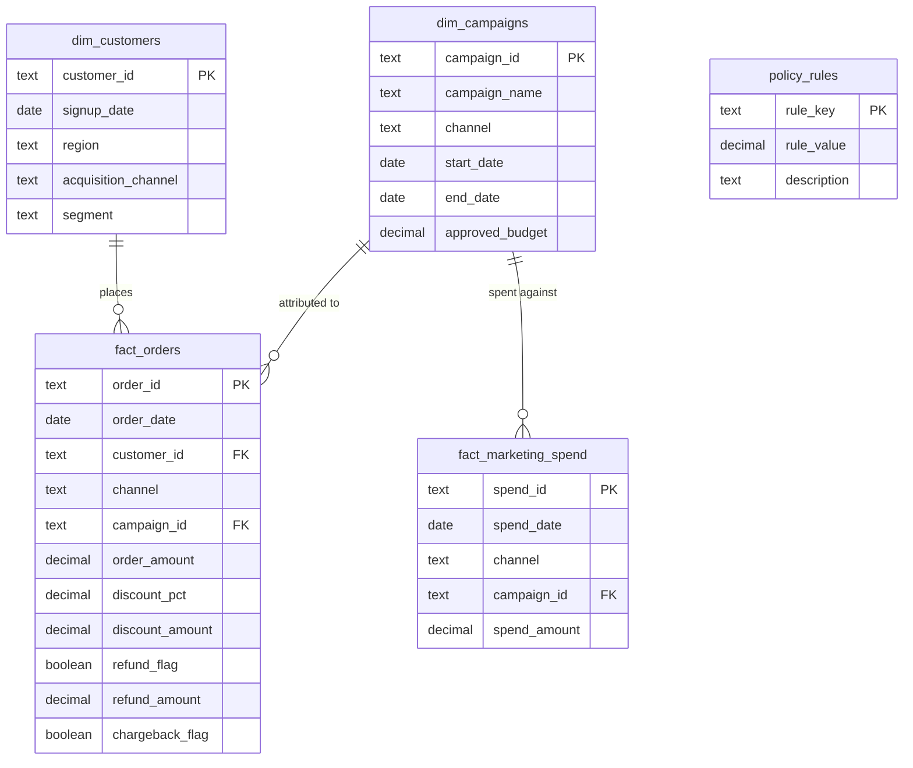

# Channel Spend & Order Integrity Analytics

**A rule-based audit engine and KPI dashboard for marketing spend and order revenue, built three ways — Python, SQL, and Excel — and cross-validated to agree exactly.**

This is a self-contained portfolio project simulating one fiscal year of operations for a fictional mid-size e-commerce retailer, **Northfield Retail Co.** It answers a specific set of business questions a marketing/revenue-ops analyst would actually be asked, then goes a step further: a rule-based audit engine that flags policy violations, data-quality issues, and wasted spend — implemented independently in Python and SQL, with identical results, and mirrored a third time as live Excel formulas.

> All data is synthetically generated (`python/generate_data.py`, fixed random seed). No real company, customer, or transaction data is used anywhere in this project.

---

## Why this project exists

Most portfolio dashboards stop at "here's a chart." This one is built around the questions a business would actually ask a new analyst to answer in their first month:

- Which channels are actually profitable, and which are burning budget for no return?
- Are we bleeding money to duplicate charges, over-discounting, or campaigns that blew past their budget?
- Which customers are quietly abusing the refund process?
- If we cleaned up every one of these issues, how many dollars would we get back?

Then it answers the follow-up a hiring manager should ask: **how do I know your numbers are right?** — by building the same audit logic three independent times and showing they agree to the penny.

---

## The cross-validation, in one table

| Metric | Python | SQL | Excel |
|---|---:|---:|---:|
| Total Revenue | $1,526,128.54 | $1,526,128.54 | $1,526,128.54 |
| Total Marketing Spend | $611,918.00 | $611,918.00 | $611,918.00 |
| Blended ROAS | 2.49x | 2.49x | 2.49x |
| Total Flagged Records | 151 | 151 | 151 |
| Estimated Recoverable Savings | $22,221.09 | $22,221.09 | $22,221.09 |

Three independent implementations of the same audit logic, three identical answers. See [`Docs/validation.md`](Docs/validation.md) for the full reconciliation across every KPI and every flag type.

---

## Data model

Star schema: two dimensions, two facts, plus a config table so audit thresholds are data, not hardcoded logic.



`campaign_id` is deliberately **not** a hard foreign key on either fact table — a small number of rows are intentionally orphaned so the audit engine has something real to catch (see below).

---

## The audit engine — 10 checks, built twice

Every check below is implemented independently in [`Python/audit_engine.py`](Python/audit_engine.py) and as a SQL view in [`SQL/audit_flags.sql`](SQL/audit_flags.sql). Thresholds live in `policy_rules` (`SQL/schema.sql`), not buried in code.

| # | Flag | What it catches |
|---|---|---|
| 1 | `excessive_discount` | Discount above the 25% policy ceiling |
| 2 | `duplicate_order` | Same customer/channel/amount/day appearing more than once |
| 3 | `outlier_order_amount` | Order amount beyond the channel's IQR fence (Q3 + 4.5×IQR) |
| 4 | `orphan_customer_id` | Order references a `customer_id` that doesn't exist |
| 5 | `repeated_refund_pattern` | 3+ identical-amount refunds from one customer (refund abuse) |
| 6 | `repeat_chargeback_customer` | 2+ chargebacks from the same customer |
| 7 | `post_campaign_attribution` | Order dated after its campaign's `end_date` (misattribution) |
| 8 | `orphan_campaign_spend` | Marketing spend logged against a non-existent `campaign_id` |
| 9 | `budget_overrun` | Campaign actual spend exceeds `approved_budget` |
| 10 | `wasted_spend_no_orders` | Meaningful same-day channel spend that produced zero orders |

**Result: 151 flagged records, $43,029.83 in total flagged dollars, $22,221.09 in estimated recoverable savings** (the subset of flags representing avoidable spend — excessive discounts, duplicates, orphaned spend, wasted spend, and budget overruns — excluding pure data-quality flags like orphan IDs, which aren't recoverable dollars).

---

## KPI framework

| KPI | Value | Definition |
|---|---:|---|
| Total Revenue | $1,526,128.54 | Order amount net of discounts |
| Total Marketing Spend | $611,918.00 | Sum of all channel spend |
| Blended ROAS | 2.49x | Revenue / Spend |
| Average Order Value | $97.93 | Mean order amount |
| Blended CAC | $145.69 | Spend / new customers signed up in the period |
| Refund Rate | 5.1% | Refunded orders / total orders |
| Chargeback Rate | 0.6% | Chargeback orders / total orders |
| Discount Leakage | $61,119.90 | Total dollars given away in discounts |
| Repeat Purchase Rate | 91.0% | Customers with 2+ orders / all customers who ordered |
| Budget Compliance Rate | 83.3% | Campaigns within approved budget / all campaigns |

---

## The dashboard

[`Dashboard/index.html`](https://sumankumaroraon.github.io/Channel-Spend-Order-Integrity-Analytics/Dashboard/) is a self-contained, four-page interactive dashboard — open it directly in a browser, no server, no build step, and **no internet connection required**. Charting (Chart.js) is vendored directly into the page rather than pulled from a CDN, so it renders identically offline, behind a corporate firewall, or with an ad-blocker running. Every number in it is generated from `outputs/kpi_summary.json` and the other pipeline outputs, so it can never drift from the audit engine's actual results.

1. **Overview** — headline KPIs, monthly revenue vs. spend trend, revenue by channel
2. **Channel & Campaign Performance** — revenue/spend/ROAS/refund rate by channel
3. **Customer & Order Quality** — refund and chargeback rates, discount leakage, repeat purchase rate
4. **Exceptions & Savings** — the full audit output: flagged-record counts, dollar impact, and the top 20 exceptions by dollar size

The `excel/` workbook mirrors the same four views as native Excel tabs with live formulas and charts, for anyone who'd rather work in a spreadsheet than a browser.

---

## Repo structure

```
├── data/
│   ├── raw/                  customers.csv, campaigns.csv, marketing_spend.csv, orders.csv
│   └── analytics.db          SQLite database (built by python/build_database.py)
├── sql/
│   ├── schema.sql            star schema DDL + policy_rules config table
│   ├── audit_flags.sql       the 10 audit checks as SQL views
│   └── kpi_queries.sql       the KPI set as standalone SQL
├── python/
│   ├── generate_data.py      synthetic data generator (fixed seed, reproducible)
│   ├── audit_engine.py       the 10 audit checks + KPI calculation, in pandas
│   ├── build_database.py     loads data/raw/*.csv into data/analytics.db per schema.sql
│   ├── build_excel.py        builds the Excel workbook (formulas, not hardcoded values)
│   ├── build_dashboard.py    generates dashboard/index.html from the pipeline outputs
│   └── vendor/chart.umd.js   Chart.js, vendored so the dashboard needs no internet access
├── excel/
│   └── Channel_Spend_Order_Integrity_Analytics.xlsx
├── dashboard/
│   └── index.html            the interactive 4-page dashboard
├── outputs/
│   ├── audit_flags.csv       full flagged-record detail
│   ├── kpi_summary.json      executive KPI set
│   ├── channel_summary.csv   channel-level rollup
│   └── monthly_trend.csv     monthly revenue/spend
└── docs/
    └── validation.md         full Python/SQL/Excel reconciliation
```

## How to reproduce

```bash
pip install -r requirements.txt

python python/generate_data.py       # -> data/raw/*.csv
python python/audit_engine.py        # -> outputs/*.csv, outputs/kpi_summary.json
python python/build_database.py      # -> data/analytics.db
python python/build_excel.py         # -> excel/*.xlsx
python python/build_dashboard.py     # -> dashboard/index.html
```

Then open `dashboard/index.html` in a browser, or `excel/Channel_Spend_Order_Integrity_Analytics.xlsx` in Excel.

To run the SQL layer directly against the database:

```bash
sqlite3 data/analytics.db < sql/audit_flags.sql
sqlite3 data/analytics.db < sql/kpi_queries.sql
```

## Design notes

- **Why ROAS lands at 2.49x, not some round number**: the channel-level spend/order simulation parameters (`python/generate_data.py`, `CHANNEL_PROFILE`) were deliberately calibrated to a realistic blended ROAS range rather than picked arbitrarily — see the comment in that file.
- **Why the outlier check uses an IQR fence instead of a raw z-score**: order amounts are right-skewed (a lognormal-ish distribution with a long tail of legitimately large orders), so a raw z-score over-flags the natural tail. An IQR fence per channel is the more defensible robust-statistics choice for skewed transaction data — and it's the difference between a 26-record exception list and a 150+ record one that isn't actually exceptional.
- **Why `campaign_id` isn't a hard foreign key**: a handful of marketing-spend rows are deliberately orphaned (logged against a campaign that doesn't exist) to give the audit engine a real, findable data-quality issue — the kind that shows up in real marketing-ops data from a broken UTM tag or a sunset campaign that didn't get cleaned up in the ad platform.

## Tech stack

Python (pandas, numpy, openpyxl) · SQL (SQLite, portable to Postgres/Snowflake/BigQuery with minor syntax changes) · Excel (native formulas, PivotTable-style rollups, charts) · HTML/CSS/JS (Chart.js) for the interactive dashboard.

## License

MIT — see [LICENSE](LICENSE).

---

*Built by Suman Oraon as an original portfolio project. All company names, transactions, and figures are synthetic.*
